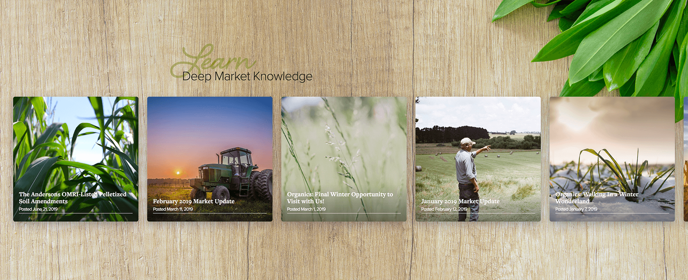
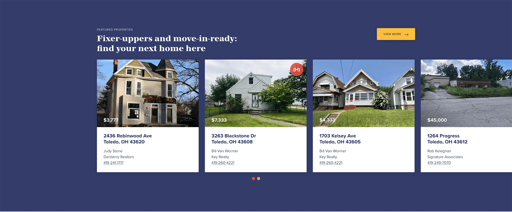
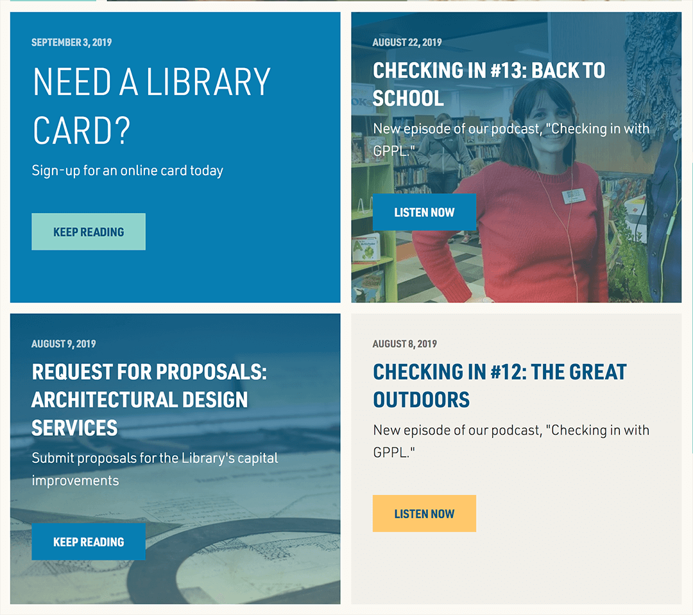

# Challenge Two

## Content Blocks

Madhouse utilizes what we refer to as Content Blocks - discreet sections of a webpage that act as standalone pieces in the content management system. Some examples of common content blocks are outlined below, along with two challenges for you to complete.

## Baseball Cards

One common Content Block we often build is a collection of card tiles that often represent events, locations, news posts, etc. 

## Challenge 2.0

Create a content block of baseball cards that:
  - contains a content block title such as "News", "Events", etc. 
  - contains at least 3 cards
  - utilizes CSS Grid with a Flexbox fallback
  - supports IE 11
  - is responsive / mobile-friendly

Each card must contain: 
  - an image pulled dynamically from the following endpoint: [Images Endpoint](https://image-transforms.madmadmad.net/images.json)
  - a title
  - a subtitle or paragraph
  - a button / link

  ### Helpful Hints: 
  - We use PostCSS with Autoprefixer to generate prefixed Grid/Flexbox CSS that targets IE 11. 

  ### Notes
  - You are not being evaluated on the final design or aesthetic of the content block, but rather the combination of HTML, CSS, and JavaScript used to create it. 
  - You may add additional design or markup elements as you see fit. 
  - You may use whatever tools you feel comfortable with, so long as the HTML, CSS, and JavaScript is written by you. (CSS preprocessors and JavaScript libraries are permitted. )

  - Target Skills/Languages: HTML, CSS, JavaScript
  - Estimated Completion Time: 30 minutes - 1 hour

## Side by Side Block

Another common Content Block we often build is a call to action or side by side block that invites the user to engage with the page in some way. 

## Challenge 2.1

Create a side by side / call to action content block that:
  - contains a block of text that includes: 
    - a heading
    - a link / button
  - is responsive / mobile-friendly
  - at least one visual element

  ### Notes
  - You are not being evaluated on the final design or aesthetic of the content block, but rather the combination of HTML, CSS, and JavaScript used to create it. 
  - You may add additional design or markup elements as you see fit. 
  - You may use whatever tools you feel comfortable with, so long as the HTML, CSS, and JavaScript is written by you. (CSS preprocessors and JavaScript libraries are permitted. )

  - Target Skills/Languages: HTML, CSS
  - Estimated Completion Time: 30 minutes - 1 hour

  ## End-Product

  The two content blocks should live in the same file and share the same stylesheet. Please place all final files into the `challenge_two` folder. 